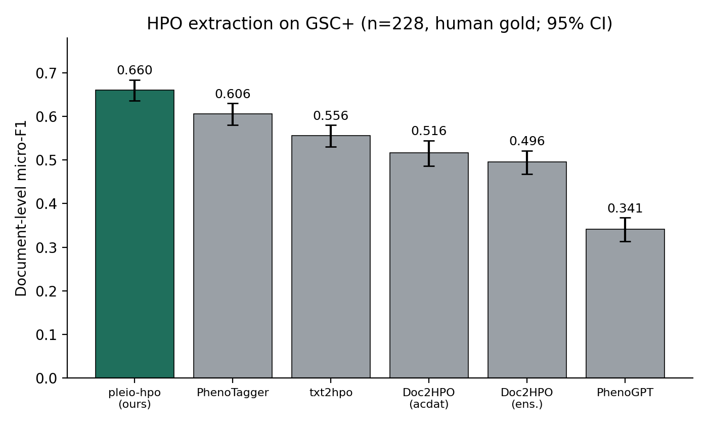
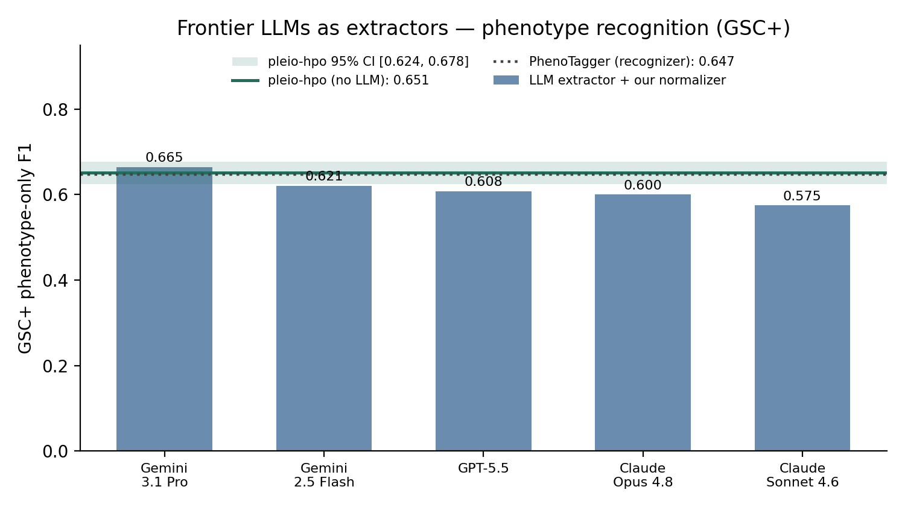

# Results — a condensed evaluation summary

This is a short, self-contained summary of how **pleio-hpo** performs against
published HPO-extraction tools. It is the lean version of a longer methods paper;
the full study (extra corpora details, ablations, cross-LLM analysis, distillation
ceiling, and a machine-verified number registry) lives in the project's research
history.

**Protocol.** Document-level micro-F1, one pinned HPO release (`v2026-02-16`),
defunct-ID filtering applied identically to every tool, 95% bootstrap CIs (10k
iterations, seed 42), and paired bootstrap tests for tool-vs-tool deltas.

## Headline: tool comparison across three human-gold corpora

pleio-hpo is evaluated on three independent corpora — GSC+ (228 PubMed abstracts),
BC8 (454 dysmorphology exam observations; in-distribution for pleio-hpo's
validator), and 112 published genetics case reports (out-of-distribution).

| Corpus | pleio-hpo | PhenoTagger | next best | verdict (pleio vs PhenoTagger) |
|---|---|---|---|---|
| GSC+ | **0.660** | 0.606 | txt2hpo 0.556 | pleio ahead, Δ+0.055 (p<0.001) |
| BC8 | **0.674** | 0.666 | txt2hpo 0.616 | tie, Δ+0.008 (p=0.60) |
| case reports (OOD) | 0.545 | **0.560** | txt2hpo 0.494 | tie, Δ−0.015 (p=0.13) |

pleio-hpo and PhenoTagger are a statistical tie on two of three corpora (pleio-hpo
leads GSC+), the nominal leader varying by corpus, both degrading similarly out of
distribution — co-equal recognizers. PhenoTagger, txt2hpo, and PhenoGPT also run
locally (offline); pleio-hpo's practical advantage is footprint: `pip install`,
CPU-only, ~1.5 GB, no TensorFlow/GPU/Java/UMLS, no data egress.

## Recognition vs term-scope coverage

Part of pleio-hpo's GSC+ lead is coverage of inheritance/onset terms the benchmark
scores. Stripping those from predictions *and* gold (a recognition-only view) puts
pleio-hpo **level with PhenoTagger**: 0.651 vs 0.647 (Δ+0.004, p=0.67). The best
frontier-LLM extractor (Gemini 3.1 Pro, 0.665) is also statistically
indistinguishable — the top three recognizers cluster within 0.018 F1.

*Caveat:* this "parity" is indistinguishability on **single-annotator** gold sets
with no measured inter-annotator agreement, so it bounds the tools' equality only up
to the gold's resolving power.

## What the architecture contributes

A three-stage pipeline: lexical matching (exact + morphology-aware + order-free
token-set) → SapBERT embedding nearest-neighbour → a PubMedBERT cross-encoder
validator. An ablation on GSC+ shows the trained validator adds **+0.022 F1**
(p<0.001) over lexical+embedding by restoring precision; the order-free token-set
stage adds the recall that closed the recognition gap to PhenoTagger (and it
generalizes out-of-distribution to BC8, +0.014 recognition, p=0.004).

## Scope and honest limits

- All three corpora are abstracts, exam observations, or case reports — **not
  raw free-text clinical notes**; performance on full-length EHR notes is untested.
- The recognition "parity" is bounded by single-annotator gold (no IAA).
- pleio-hpo is decision-support, not a clinically validated device (see README).
